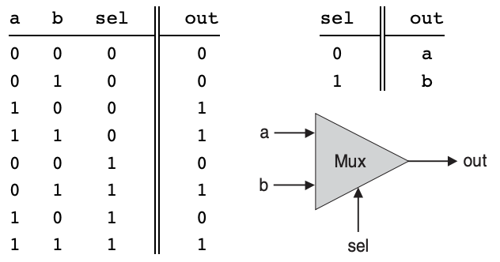
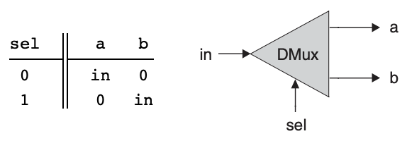

# 💻 The Elements of Computing System - 1

## 🤔 불 대수(Boolean Algebra)
- true/false, 예/아니오, 켜짐/꺼짐 같은 불값을 다루는 대수학
- 컴퓨터는 진수를 표현하고 처리하는 하드웨어이기 때문에 2진수 입력을 가공해 2진수 출력을 하는 불 함수를 정의하고 분석하는 것이 컴퓨터 아키텍쳐를 구축하는 첫 단계가 됨

<br>

## 🤔 하드웨어 기술 언어

```
CHIP Xor {
    IN x, y;
    OUT out;
    PARTS:
        Not(in=x, out=notx);
        Not(in=y, out=noty);
        And(x=x, y=noty, out=w1);
        And(x=notx, y=y, out=w2);
        Or(x=w1, y=w2, out=out);
}
```
* HDL program(Xor.hdl)
  * Xor(exclusive or) gate
  * if x<>y out=1 else out=0
- HDL의 헤더 부분에서는 칩 인터페이스 정의
- 칩의 이름과 입력 및 출력 이름을 명시
- 파트는 해당 칩의 내부 구현 담당
- 헤더에서 명시된 입력을 각종 불 함수를 사용해 원하는 출력값을 만들어 냄

```
load Xor.hdl
output-list x, y, out;
set x 0, set y 0,
eval, output;
set x 0, set y 1,
eval, output;
set x 1, set y 0,
eval, output;
set x 1, set y 1,
eval, output;
```
* Text script(Xor.tst)
- 테스트 스크립트는 설계한 칩을 실행시킴
- 실행하고자 하는 칩을 불러와서 입력 값을 설정하고 실행함

```
x | y | out
-----------
0 | 0 | 0
0 | 1 | 1
1 | 0 | 1
1 | 1 | 0 
```
* Output file(Xor.out)
- 실행이 끝나고 나면 입력 값의 출력 데이터를 기록한 .out 파일을 생성

<br>

## 🤔 Nand 게이트

```
x y | Nand(x, y)
----------------
0 0 |     1
0 1 |     1
1 0 |     1
1 1 |     0 
```
- 다른 모든 게이트들의 기초가 되는 게이트

<br>

## 🤔 기본 논리 게이트
- Not
  - 단일 입력 Not 게이트는 'converter'라고도 불리며, 입력값을 반전시킴
- And
  - 입력값이 둘다 1일 경우에 1을, 그 외에는 0을 반환
- Or
  - 입력값 중 적어도 하나가 1일 때 1을, 그 외에는 0을 반환
- Xor
  - 'exclusive or'이라고도 불리며, 두 입력값이 다를 경우 1, 그 외에는 0을 반환
- Multiplexor
  - '선택 비트' 입력에 따라서 두 개의 '데이터 비트' 입력 중 하나를 선택해 반환
  - 
- DeMultiplexor
  - 멀티플렉서와 정반대 기능을 함
  - '선택 비트'에 따라 두 출력선 중 하나를 선택해 입력 신호를 반환
  - 

<br>

## 🤔 구현

```
CHIP Not {
    IN in;
    OUT out;

    PARTS:
    // Put your code here:
    Nand(a=in, b=in, out=out);
}
```
- Not

```
CHIP And {
    IN a, b;
    OUT out;

    PARTS:
    // Put your code here:
    Nand(a=a, b=b, out=nandAB);
    Nand(a=nandAB, b=nandAB, out=out);
}
```
- And

```
CHIP Or {
    IN a, b;
    OUT out;

    PARTS:
    // Put your code here:
    Not(in=a, out=Nota);
    Not(in=b, out=Notb);
    Nand(a=Nota, b=Notb, out=out);
}
```
- Or

```
CHIP Xor {
    IN a, b;
    OUT out;

    PARTS:
    // Put your code here:
    Not(in=a, out=notA);
    Not(in=b, out=notB);
    And(a=a, b=notB, out=AandNotB);
    And(a=notA, b=b, out=BandNotA);
    Or(a=AandNotB, b=BandNotA, out=out);
}
```
- Xor

```
CHIP Mux {
    IN a, b, sel;
    OUT out;

    PARTS:
    // Put your code here:
    Not(in=sel, out=Notsel);
    And(a=sel, b=b, out=bsel);
    And(a=Notsel, b=a, out=aNotsel);
    Or(a=aNotsel, b=bsel, out=out);
}
```
- Multiplexor

```
CHIP DMux {
    IN in, sel;
    OUT a, b;

    PARTS:
    Not(in=sel, out=Notsel);
    And(a=in, b=Notsel, out=a);
    And(a=in, b=sel, out=b);
    // Put your code here:
}
```
- DeMultiplexor

```
/**
 * 16-bit multiplexor: 
 * for i = 0..15 out[i] = a[i] if sel == 0 
 *                        b[i] if sel == 1
 */

CHIP Mux16 {
    IN a[16], b[16], sel;
    OUT out[16];

    PARTS:
    Mux(a=a[0], b=b[0], sel=sel, out=out[0]);
    Mux(a=a[1], b=b[1], sel=sel, out=out[1]);
    Mux(a=a[2], b=b[2], sel=sel, out=out[2]);
    Mux(a=a[3], b=b[3], sel=sel, out=out[3]);
    Mux(a=a[4], b=b[4], sel=sel, out=out[4]);
    Mux(a=a[5], b=b[5], sel=sel, out=out[5]);
    Mux(a=a[6], b=b[6], sel=sel, out=out[6]);
    Mux(a=a[7], b=b[7], sel=sel, out=out[7]);
    Mux(a=a[8], b=b[8], sel=sel, out=out[8]);
    Mux(a=a[9], b=b[9], sel=sel, out=out[9]);
    Mux(a=a[10], b=b[10], sel=sel, out=out[10]);
    Mux(a=a[11], b=b[11], sel=sel, out=out[11]);
    Mux(a=a[12], b=b[12], sel=sel, out=out[12]);
    Mux(a=a[13], b=b[13], sel=sel, out=out[13]);
    Mux(a=a[14], b=b[14], sel=sel, out=out[14]);
    Mux(a=a[15], b=b[15], sel=sel, out=out[15]);
}
```
- 16비트 Multiplexor
  - 1비트 게이트를 이어붙혀 설계함

```
/**
 * 4-way 16-bit multiplexor:
 * out = a if sel == 00
 *       b if sel == 01
 *       c if sel == 10
 *       d if sel == 11
 */

CHIP Mux4Way16 {
    IN a[16], b[16], c[16], d[16], sel[2];
    OUT out[16];

    PARTS:
    // Put your code here:
    Mux16(a=a, b=b, sel=sel[0], out=muxAB);
    Mux16(a=c, b=d, sel=sel[0], out=muxCD);
    Mux16(a=muxAB, b=muxCD, sel=sel[1], out=out);
}
```


- 토너먼트 형식으로 일전에 설계한 2x1 Mux로 4개의 입력을 2개로 추리고 추려진 2개의 입력 중 마지막 Mux로 최종 출력값 결정
- 이 때, 선택 비트를 2bit로 늘려서 첫 연산과 마지막 Mux 연산에 각각 선택 비트 한 개씩을 사용함