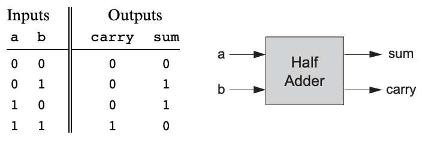
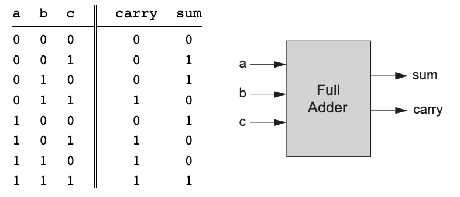
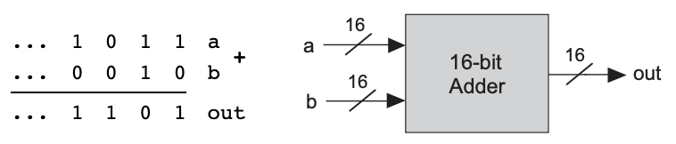
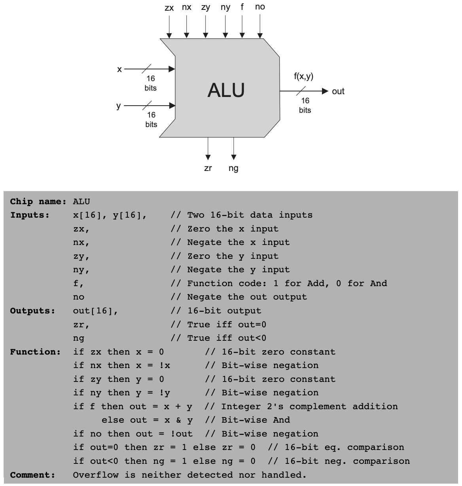

# 💻 The Elements of Computing System - 2

## 🤔 2진수
- 컴퓨터는 수를 2진수로 다룸
- 10진수 : 21
  - 2진수 : 10101($2^4\times1+2^2\times1+1$)

<br>

## 🤔 2진 덧셈
- 최하위 비트부터 최상위 비트까지 같은 자리의 수끼리 자리올림수까지 고려해 더함
- 마지막 비트를 더하고 나서 자리올림수가 1이라면, 오버플로 발생

<br>

## 🤔 부호가 있는 2진수
- 컴퓨터는 2의 보수(2's complement) 방식 사용
- $x$의 보수 = $2^n-x$
  - 0은 1로, 1은 0으로 뒤집은 뒤 +1 해주면 음수가 됨
  - 모든 음수 코드는 1로 시작함

<br>

## 🤔 반가산기


- 두 비트를 더하는 기능을 함
- 덧셈한 값의 최하위 비트를 sum, 최상위 비트를 carry라고 함

<br>

## 🤔 전가산기


- 세 개의 비트를 더하는 기능을 함
- 출력은 반가산기와 같음

<br>

## 🤔 가산기


- 메모리와 레지스터 칩은 n비트 패턴으로 된 정수를 저장하고, n은 플랫폼에 따라 16, 32, 64 등등의 값이 됨
- 이런 숫자를 덧셈하는 칩을 멀티비트 가산기 혹은 가산기라 부름

<br>

## 🤔 증분기
- 주어진 숫자에 1을 더하는 기능을 함

<br>

## 🤔 산술 논리 연산 장치(ALU)


- Arithmetic Logic Unit
- x와 y가 칩의 두 16비트 입력이고, 16비트 출력 값을 가짐
- 주어진 2진 값들에 대해 ALU가 어떤 연산을 할지는 '제어 비트'라는 6개의 입력 비트를 통해서 결정함

<br>

## 🤔 구현

```
CHIP HalfAdder {
	IN a, b;	// 1-bit inpus
	Out carry,	// Left bit of a + b
		sum;	// Right bit of a + b

	PARTS:
	// Put you code here:
	And(a=a, b=b, out=carry);
	Xor(a=a, b=b, out=sum);
}
```
- Half-Adder
- sum은 Xor과 같음
- carry는 And와 같음

```
CHIP FullAdder {
	IN a, b, c;	// 1-bit inputs
	OUT carry,	// Left bit of a + b + c
		sum;	// Right bit of a + b + c

	PARTS:
	HalfAdder(a=a, b=b, carry=carryAB, sum=sumAB);
	HalfAdder(a=sumAB, b=c, sum=sum, carry=carrySumABSumC);
	Or(a=carryAB, b=carrySumABSumC, out=carry);
}
```
- Full-Adder
- a와 b를 반가산기로 더한 sum을 c와 더하면 최종 sum 도출
- 각각의 반가산기에서 발생한 carry를 Or 연산하면 최종 carry 도출

```
CHIP ALU {
    IN  
        x[16], y[16],  // 16-bit inputs        
        zx, // zero the x input?
        nx, // negate the x input?
        zy, // zero the y input?
        ny, // negate the y input?
        f,  // compute out = x + y (if 1) or x & y (if 0)
        no; // negate the out output?

    OUT 
        out[16], // 16-bit output
        zr, // 1 if (out == 0), 0 otherwise
        ng; // 1 if (out < 0),  0 otherwise

    PARTS:
    // Put you code here:
    Mux16(a=x, b[0..15]=false, sel=zx, out=zX);     // zx가 1이라면 x를 0으로 초기화한다. 
    Not16(in=zX, out=notZx);                        
    Mux16(a=zX, b=notZx, sel=nx, out=znX);          // nx가 1이라면 현시점의 x값을 반전시킨다. 

    Mux16(a=y, b[0..15]=false, sel=zy, out=zY);     // zy가 1이라면 y를 0으로 초기화한다. 
    Not16(in=zY, out=notZy);
    Mux16(a=zY, b=notZy, sel=ny, out=znY);          // ny가 1이라면 현시점의 y값을 반전시킨다. 

    And16(a=znX, b=znY, out=andznXY);               
    Add16(a=znX, b=znY, out=addznXY);
    Mux16(a=andznXY, b=addznXY, sel=f, out=fout);       // f값으로 and, add 중 어떤 연산을 할지 결정한다. 
    Not16(in=fout, out=nfout);
    Mux16(a=fout, b=nfout, sel=no, out[0..7]=out1, out[8..15]=out2, out[15]=ng, out=out);   // no값이 1이면 결과값을 반전시킨다. 최종 출력값이 음수라면 ng를 1로 초기화한다. 

    Or8Way(in=out1, out=orOut1);
    Or8Way(in=out2, out=orOut2);
    Or(a=orOut1, b=orOut2, out=orOut);      // 출력값을 앞, 뒤로 나누어서 or연산을 해, 1이 존재하는지 검사한다. 

    Not(in=orOut, out=zr);  //  or연산의 최종값에 따라서 zr을 결정한다. 
}
```
- ALU