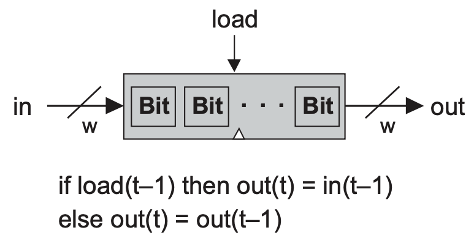

# 💻 The Elements of Computing System - 3

## 🤔 순차 논리
- 조합 논리의 결과 데이터는 연산이 종료된 후 소멸되기 때문에 더 복잡한 연산을 하기 위해서는 데이터를 기억할 필요가 있음
  - 데이터를 기억하고 기억한 데이터를 사용하기 위해서 **_'순차 논리'_** 를 사용함
- **클록**
  - 마스터 클록(master-clock)이 연속적인 신호를 발생시킴
  - 보통 0과 1로 표시된 두 상태를 연속해서 오가는 것으로 표현함
- **플립플롭**
  - 가장 기본적인 순차 논리 소자
  - 1비트 데이터 입력과 클록 신호 입력에 따라 새로 입력된 데이터를 출력할지, 잠금상태가 되어 이전 입력을 유지할지 결정됨
- **레지스터**
  - DFF(데이터 플립플롭)만으로는 데이터를 원하는대로 저장하고 가져올 방법이 없기 때문에, 이전 시간의 출력 데이터를 다시 입력하는 방법을 사용한 것이 레지스터
  - 새로운 데이터를 입력할지, 이전 결과를 입력할지를 MUX(멀티플렉서)가 결정함
  - 
    - 1bit register
  - 
    - 1bit register를 이어붙힌 w-bit register
  - 레지스터가 저장할 수 있는 비트의 개수 : 폭(width)
    - 16, 32, 64비트가 폭을 뜻함
  - 레지스터에 저장되는 멀티비트 값 : 단어(word)
- **메모리** 
  - 레지스터를 여러 개 쌓아 올려서 여러 저장 공간을 한 번에 사용할 수 있는 임의 접근 메모리를 만들 수 있음
  - n개의 각 레지스터에는 접근할 때 사용되는 유일한 주소가 할당됨
  - 
    - 주소는 어떤 RAM 레지스터에 접근할지를 가리킴
    - 읽기 연산(load=0)인 경우, RAM은 선택된 레지스터의 값을 바로 출력함
    - 쓰기 연산(load=1)일 때는 다음 사이클 때 선택된 메모리 레지스터에서 입력값을 받아 해당 값을 출력하기 시작함
- **계수기**
  - 매 시간 단위마다 내부 상태 값을 증가시키는 순차 칩
    - 프로그램 계수기(program counter)
- **시간 문제**
  - 컴퓨터는 짧은 시간 안에 수 많은 명령을 처리하기 때문에 조합 칩으로만 구성되어 있을 경우, 데이터 경쟁이 발생하기 쉬움
  - 순차 칩의 출력은 클록 사이클이 넘어갈 때만 바뀔 수 있기 때문에 데이터 경쟁을 피하고 전체 컴퓨터 구조를 동기화 시킬 수 있음

<br>

## 🤔 Data Filp-Flop
- DFF는 모든 메모리 소자의 기본 부품이 됨
- 각각 하나의 마스터 클록에 연결되어, 거대한 합창단 같이 행동함
- 클록 사이클이 시작할 때, 컴퓨터 내 모든 DFF 출력들은 전 사이클의 입력에 따라 맞춰짐
- 그 외 시간에는 DFF가 잠금 상태가 됨
  - 입력이 변해도 출력이 곧바로 영향을 받지 않음

<br>

## 🤔 Register
- 1비트 레지스터는 하나의 정보 비트(0 or 1)을 저장하도록 설계된 소자
- 레지스터(w-bit)는 멀티비트 값을 처리할 수 있다는 점을 제외하면 기본적으로 2진 셀과 API가 동일함

<br>

## 🤔 Memory
- RAM은 직접 접근 메모리 장치
  - n개의 w-bit 레지스터를 배열하고 직접 접근 회로를 연결한 소자
- 메모리에 들어간 레지스터의 개수(n) 및 비트 수(w)는 각각 메모리의 크기와 폭이라 부름

<br>

## 🤔 Counter


- 다음 번에 실행할 명령의 주소를 기록
  - 계수기는 매 클록 사이클마다 단순히 상태 값을 1 증가시켜 프로그램의 다음 번 명령어를 불러올 수 있게 함
  - 프로그램의 첫 명령 주소가 0이라고 한다면 계수기를 0으로 리셋해서 프로그램을 언제든지 재시작시킬 수 있어야 함

<br>

## 🤔 구현

```
CHIP Bit {
    IN in, load;
    OUT out;

    PARTS:
    Mux(a=dout, b=in, sel=load, out=selected);
    DFF(in=selected, out=out, out=dout);
}
```
- 1Bit Register
- DFF 출력값을 다시 DFF의 입력으로 넣는 것이 기본 구성
- 새로운 입력과 이전 데이터 중에서 충돌은 Mux를 활용해 해결

```
CHIP Register {
    IN in[16], load;
    OUT out[16];

    PARTS:
    Bit(in=in[0], load=load, out=out[0]);
    Bit(in=in[1], load=load, out=out[1]);
    ...
    Bit(in=in[15], load=load, out=out[15]);
}
```
- Register
- 기본적인 16비트 데이터를 저장할 수 있는 레지스터
- 1Bit 레지스터를 16개 이어 붙힘

```
CHIP RAM8 {
    IN in[16], load, address[3];
    OUT out[16];

    PARTS:
    DMux8Way(in=load, sel=address, a=r0, b=r1, c=r2, d=r3, e=r4, f=r5, g=r6, h=r7);
    Register(in=in, load=r0, out=out0);
    Register(in=in, load=r1, out=out1);
    Register(in=in, load=r2, out=out2);
    Register(in=in, load=r3, out=out3);
    Register(in=in, load=r4, out=out4);
    Register(in=in, load=r5, out=out5);
    Register(in=in, load=r6, out=out6);
    Register(in=in, load=r7, out=out7);
    Mux8Way16(a=out0, b=out1, c=out2, d=out3, e=out4, f=out5, g=out6, h=out7, sel=address, out=out);
}
```
- RAM8
- 레지스터를 8개 갖고 있는 RAM
- 주소값을 입력으로 받는데, 3비트 주소 데이터로 어디 레지스터에 접근할지를 DMux가 결정
  - 접근된 레지스터에만 load비트 입력이 주어짐
- 모든 레지스터 칩이 작동하지만, 그 중 RAM의 출력값으로 결정되는 레지스터는 주소값에 해당되는 레지스터
  - 칩의 마지막에 Mux가 담당

```
CHIP PC {
    IN in[16],load,inc,reset;
    OUT out[16];

    PARTS:
    Inc16(in=din, out=incd);    // 레지스터에서 선택된 입력값의 1증가값을 미리 계산해 놓는다. 
    Mux16(a=din, b=incd, sel=inc, out=out1);    // inc값에 따라서 증가값을 사용할지 결정한다. 
    Mux16(a=out1, b=in, sel=load, out=out2);    // load값에 따라서 새로운 입력을 사용할지 결정한다. 
    Mux16(a=out2, b[0..15]=false, sel=reset, out=reseted);  // reset값에 따라서 선택된 입력을 0으로 리셋할지 결정한다. 
    Register(in=reseted, load=true, out=din, out=out);  // 최종 결정된 입력을 레지스터에 넣어 저장한다. 
}
```
- PC(Program Counter)
- PC의 레지스터에 어떤 명령어 주소가 입력되는지 중요
  - load, inc, reset 비트를 활용하여 최종적으로 레지스터에 어떤 값을 넘겨줄지 설계