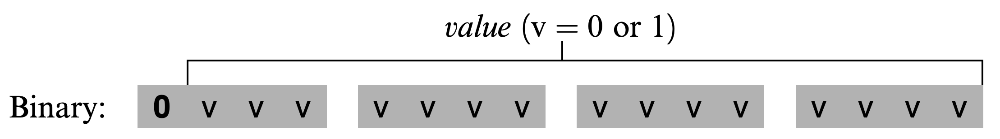
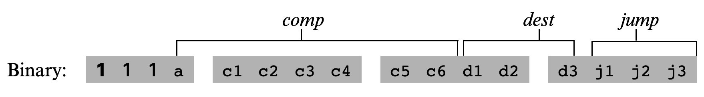
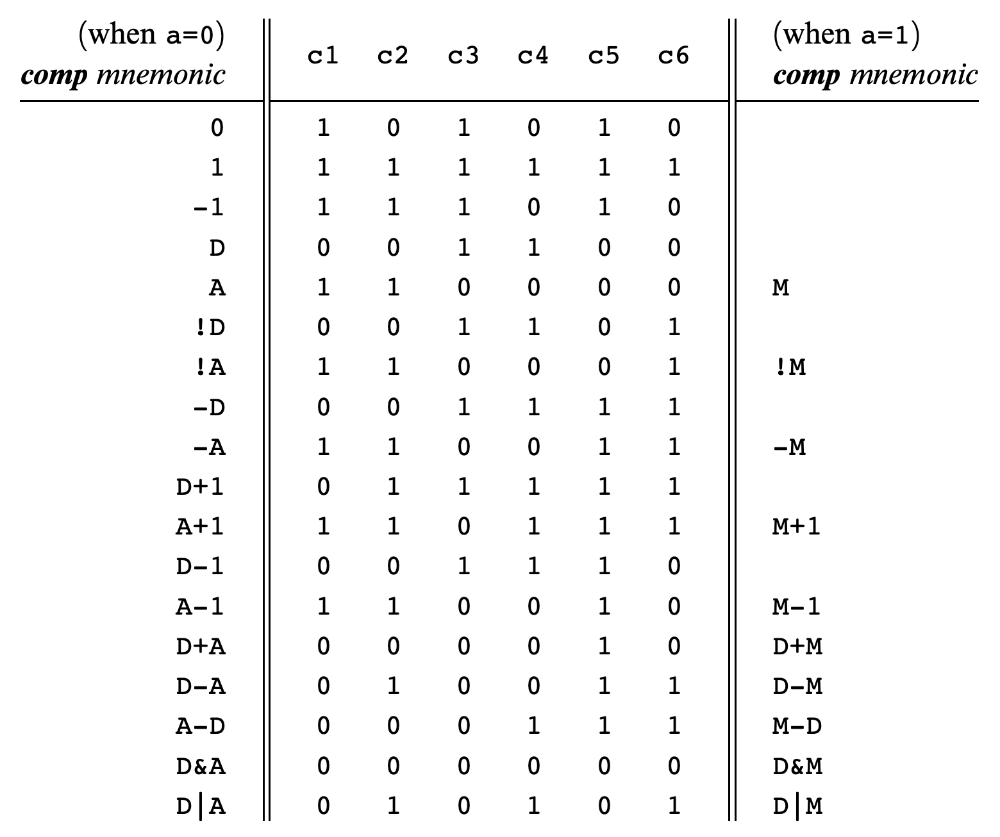
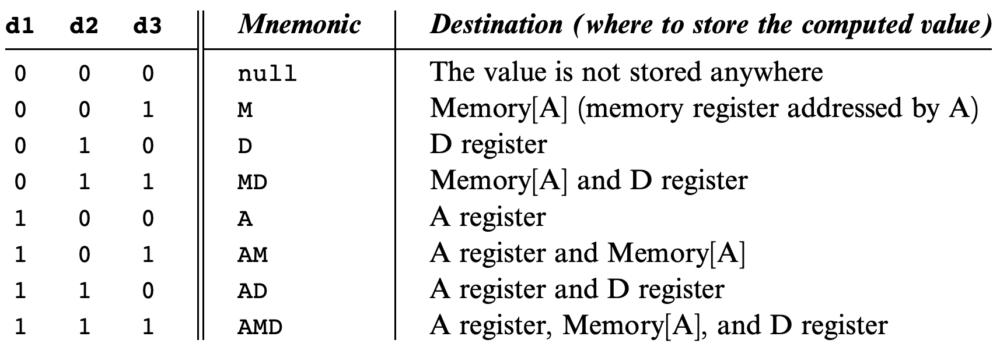
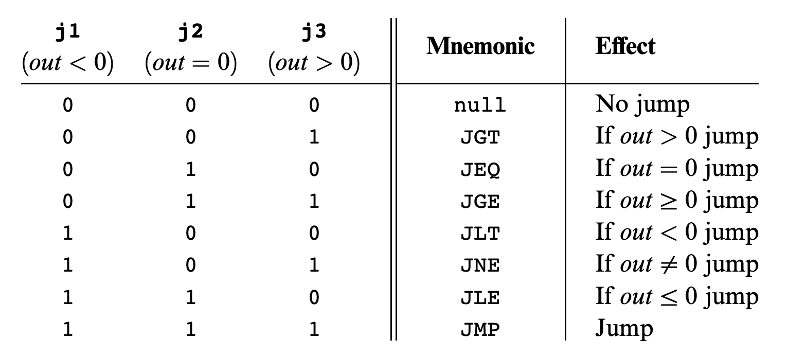

# 💻 The Elements of Computing System - 4

## 🤔 기계어
- 프로세서와 레지스터들을 이용해서 메모리를 조작할 수 있도록 미리 정의된 규칙
- 대상 하드웨어 플랫폼에서 직접 명령 실행 및 하드웨어 완전 제어가 목적
- **메모리** : 컴퓨터에서 데이터와 명령어를 저장하는 하드웨어 장치
- **프로세서** : CPU라고 불리는 프로세서는 미리 정해진 기초 연산들을 수행하는 장치
  - 메모리와 레지스터에 있는 2진 값을 피연산자로 두고, 연산을 출력값은 선택된 메모리 주소나 레지스터에 저장됨
- **레지스터** : 항상 CPU와 거리가 있는 메모리와 데이터를 주고 받기에는 시간이 상대적으로 많이 걸리기 때문에 대부분의 프로세서는 값을 하나 저장할 수 있는 레지스터를 바로 옆에 여러 개 두고 있음

<br>

## 🤔 언어
- 기계어 프로그램은 명령어들을 2진 코드화 한 것
- 기계어는 보통 2진 코드와 연산기호를 둘 다 사용하도록 되어 있음
- 16비트 컴퓨터 명령 : `1010 0011 0001 1001`
  - 4비트씩 4개의 필드로 구성
  - 맨 왼쪽 필드는 CPU 연산 종류, 나머지는 피연산자
  - `1010` 은 ADD, 나머지 필드는 각각 R3, R1, R9 의미
- **어셈블리 언어 or 어셈블리** : 연산기호들을 사용한 표기법
- **어셈블러** : 어셈블리를 2진 기계어 코드로 변역하는 프로그램

<br>

## 🤔 명령

```assembly
// R1, R2, R3는 레지스터
ADD R2,R1,R3    // R2<-R1+R3
ADD R2,R1,foo   // R2<-R1+foo, foo는 사용자 정의 이름, foo가 가리키는 메모리 주소 값을 뜻함
AND R1,R1,R2    // R1<-R1과 R2를 비트 단위 And 연산 결과
```
- 산술 및 논리 연산
  - 모든 컴퓨터에는 기초 산술 연산 외에도 비트 반전, 비트 이동 등의 불연산, 논리 연산도 가능해야 함

```assembly
// 직접 주소 지정 방식
LOAD R1,67  // R1<-Memory[67]
LOAD R1,bar // R1<-Memory[67], bar가 메모리 주소 67을 가리킴

// 즉시 주소 지정 방식
LOAD R1,67  // R1<-67

// 간접 주소 지정 방식
// x=foo[j] or x=*(foo+j)
ADD R1,foo,j    // R1<-foo+j
LOAD* R2,R1     // R2<-Memory[R1]
STR R2,x        // x<-R2
```
- 메모리 접근
  - 메모리 접근은 산술 및 논리 명령에 자연스럽게 포함되어 있음
  - 레지스터와 메모리 사이에 데이터를 이동시키는 로드, 저장 명령이 있음

```assembly
// High
while(R1>=0) {
    (1)...
}
(2)...

// Low
beginWhile:
    JNG R1, endWhile    // If R1<0 goto endWhile
    (1)...
    JMP beginWhile      // goto beginWhile
endWhile:
(2)...
```
- 제어 흐름
  - 프로그램의 명령들은 보통 순서대로 실행되지만, 다른 위치로 분기해서 실행되기도 함
  - 반복, 조건 실행, 서브루틴 호출 등

<br>

## 🤔 핵 기계어
- 기본적으로 핵 컴퓨터는 폰 노이만 플랫폼이고 CPU, 명령어 메모리, 데이터 메모리, 메모리 매핑 I/O 장치로 구성된 16비트 장치
- **메모리 주소 공간**
  - 핵에서는 명령어를 저장하는 메모리, 데이터를 저장하는 메모리로 주소 공간이 분리되어 있음
  - 폭이 16비트인 두 메모리의 주소 공간은 15비트로, 최대 32K개의 16비트 단어들에 주소를 할당할 수 있음
  - 핵 CPU는 명령어 메모리(ROM)에 존재하는 프로그램만 수행할 수 있음
- **레지스터**
  - 핵 시스템에는 데이터 값만을 저장하는 D 레지스터와 데이터 값과 주소 값을 저장할 수 있는 A 16비트 레지스터가 있음
    - D=M+1에서 M은 항상 A에 저장된 값을 주소로 하는 메모리 데이터를 의미하며, 분기명령어의 도착 위치는 항상 A에 저장된 값을 목적지로 함

<br>

## 🤔 A-명령어


- A 레지스터에 15비트 값을 설정하는 데 쓰임
  - (1) 상수
  - (2) 데이터 주소
  - (3) 점프할 명령어 주소
- 사용법 : `@value`
  - value는 음수가 아닌 10진수, 또는 그 숫자를 참조하는 기호

<br>

## 🤔 C-명령어

```
C-Command : dest = comp;jump    
// dest나 jump 필드는 공란일 수 있음
// dest가 공란이면 '='가 생략됨
// jump가 공란이면 ';'가 생략됨
```


- 핵 플랫폼에서 거의 모든 일을 수행함
  - (1) 무엇을 계산?
  - (2) 계산된 값을 어디에 저장?
  - (3) 그 다음 할 일은 무엇?
- 최상위 비트 값 1은 이 명령어가 C-명령어임을 나타내는 코드
  - 그 다음 두 비트는 사용되지 않음
- comp 필드 : ALU가 할 연산이 무엇인지
- dest 필드 : 계산된 값을 어디에 저장할지
- jump 필드 : 점프 조건


- 계산 필드
  - 계산 필드의 a비트는 A 레지스터와 메모리의 값 중 어느 것을 계산할 것인지를 결정해줌
  - 나머지 c1~6은 어떤 계산을 할지 결정(= ALU)


- 목적지 필드
  - comp 부분에서 계산된 값을 어디에 저장할지를 나타냄
  - d1은 A 레지스터, d2는 D 레지스터, d3는 Memory[A]를 담당하는데, 활성화된 비트가 담당하는 장소에 값을 저장


- 점프 필드
  - 명령을 수행한 컴퓨터가 이제 어느 위치의 명령을 수행할지 결정함
  - 실제로 점프할지는 ALU의 출력값에 달렸는데, 출력값이 음수라면 j1, 0이라면 j2, 양수라면 j3 비트를 보고 점프 여부 결정

<br>

## 🤔 기호
- 어셈블리 명령은 상수나 기호를 이용햇 메모리 주소 참조 가능
- **미리 정의된 기호**
  - 가상 레지스터 : R0~R15는 RAM 주소 0~15를 가리키도록 정의함
  - 미리 정의된 포인터 : SP, LCL, ARG, THIS, THAT 기호는 각각 RAM 주소 0~4를 참조하도록 정의함
    - 가상머신 구현 시 유용하게 사용됨
  - I/O 포인터 : SCREEN과 KBD 기호는 각각 RAM 주소 16384(0x4000)과 24576(0x6000)을 참조함
    - 스크린 및 키보드의 메모리 매핑 시작 주소가 됨
- **레이블 기호**
  - 분기 명령어의 목적지를 나타냄
  - 사용자가 '(XXX)' 라는 의사 명령으로 직접 선언함
- **변수 기호**
  - 이전 두 가지 기호가 모두 아닌 경우
  - 어셈블러는 RAM 주소 16에서부터 차례대로 변수마다 유일한 메모리 주소를 할당함

<br>

## 🤔 I/O 조작
- 핵 플랫폼은 키보드와 스크린 장치에 연결될 수 있음
- 두 장치는 메모리 맵을 통해 컴퓨터와 통신함
  - 키보드 입력은 해당 메모리 맵에 저장되고, 스크린에 해당하는 메모리 위치에 값을 쓰면 그에 대응하는 스크린 위에 픽셀이 쓰여짐
- **스크린**
  - 
- **키보드**