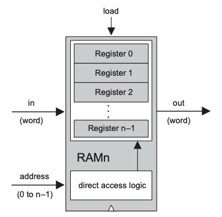

# 💻 The Elements of Computing System - 5

## 🤔 내장식 프로그램 개념
- 컴퓨터는 정해진 명령어 집합들을 실행하는 고정된 하드웨어 플랫폼에 기반함
- 컴퓨터가 실행하는 명령어들은 기본 블록이 되어 무한히 복잡한 프로그램으로 조합됨
- 프로그램들은 하드웨어에 내장되지 않는 대신, 프로그램의 코드는 컴퓨터 메모리 상에 바로 데이터처럼 저장되고 연산되는데, 이것을 '소프트웨어'라 부름

<br>

## 🤔 폰 노이만 구조


- 폰 노이만 구조는 중앙 처리 장치를 기반으로 하며, 이 장치는 메모리와 통신하고, 입력 장치에서 데이터를 받고, 출력 장치에 데이터를 보내는 일을 함

<br>

## 🤔 메모리
- 폰 노이만 기계의 메모리는 데이터와 명령어, 두 종류의 정보를 저장함
  - 두 정보는 보통 다르게 취급되고, 어떤 컴퓨터에서는 메모리 장치를 분리해서 따로 저장하기도 함
  - 두 정보의 기능은 다르지만, 동일한 무작위 접근 구조에 2진수로 저장된다는 점은 같음
- **데이터 메모리**
  - 고수준 프로그램은 변수, 배열, 객체같은 추상적 개념을 다룸
  - 이런 추상적 데이터들을 기계어로 번역하면 2진 숫자열로 바뀌어 데이터 메모리에 저장됨
- **명령어 메모리**
  - 고수준 명령들을 기계어로 번역하면 2진수 기계어 명령어를 뜻하는 단어들이 됨
  - 이 명령어들은 명령어 메모리에 저장됨

<br>

## 🤔 중앙 처리 장치
- 중앙 처리 장치는 불러온 프로그램의 명령어를 실행하는 일을 담당함
  - 이 명령어들을 통해 다양한 계산을 수행(ALU), 메모리에 값을 읽거나 쓰고(레지스터), 조건에 따라 다른 명령어로 점프(제어 장치)함
- **산술 논리 연산 장치**
  - 컴퓨터에서 지원하는 모든 저수준 산술, 논리 연산을 수행하는 장치
  - 일반적인 ALU는 두 값을 더하거나, 어떤 숫자가 양수인지 확인하거나, 데이터 단어의 비트를 조작하는 등의 일을 할 수 있음
- **레지스터**
  - CPU는 간단한 계산을 빠르게 수행하도록 설계됨
  - 매번 데이터를 메모리에서 로드하고 저장하기보다는, CPU 근처에 저장할 수 있는 고속 레지스터를 약간씩 갖추고 있음
- **제어 장치**
  - 보통 16, 32, 64bit 2진 코드로 표현되는 컴퓨터 명령어를 해석해서 ALU, 레지스터, 메모리가 무엇을 해야 하는지 전달함
  - 어떤 명령어를 인출하고 다음에 실행할지 알아내는 역할도 함
- _CPU 연산은 명령어(단어)를 메모리에서 인출하고, 해석하고, 실행하고, 다음 명령어를 인출하는 루프가 반복되는 것으로 묘사 가능_

<br>

## 🤔 레지스터
- 메모리 접근은 느린 작업
- CPU가 메모리 주소 a의 내용을 가져오라는 지시를 받은 후 과정
  - (1) a가 CPU에서 RAM으로 전달됨
  - (2) RAM의 직접 접근 논리에 따라 주소가 a인 메모리 레지스터가 선택됨
  - (3) RAM[a]의 내용이 CPU로 다시 전달됨
- 레지스터는 CPU 칩 내부에 물리적으로 위치해 있고, 메모리 셀은 거의 수백만 개가 있지만 보통 레지스터는 소수만 있기 때문에 데이터를 옮기고 메모리를 탐색하는데 비용을 들이지 않음
- CPU들은 여러 용도로 여러 가지 종류의 레지스터를 각각 다른 개수만큼 사용함
- **데이터 레지스터**
  - CPU의 단기 기억 메모리 기능을 함
  - (a-b)*c 계산 시, (a-b) 값을 메모리에 임시로 저장할 수 있지만, CPU 내부에 저장하는 편이 더 효율적이기에 그 용도로 '데이터 레지스터'를 둠
- **주소 지정 레지스터**
  - CPU는 데이터를 읽고 쓰기 위해서 계속 메모리에 접근해야 함
  - 메모리에 접근할 메모리 단어(주소)를 지정해야 함
  - 이 주소가 현재 명령어에 포함되어 있지 않은 경우, '주소 지정 레지스터'에 저장된 예전 명령어의 실행 결과(주소)를 이용하기도 함
- **프로그램 계수기 레지스터**
  - CPU가 명령어 메모리에서 인출해야 할 다음 명령어의 주소를 저장함
  - 실행 중인 명령어에 goto 문이 없는 경우, PC가 프로그램의 다음 명령어를 가리키도록 값을 증가시키고, goto n 문이 있는 경우, PC에 n 값을 로드함

<br>

## 🤔 I/O
- **메모리 매핑 I/O**
  - I/O 장치와 컴퓨터가 연결되면 빈 메모리에 해당 장치가 사용할 공간을 할당함
  - I/O 장치를 에뮬레이션해서, CPU가 그 장치를 일반적인 메모리 세그먼트처럼 보이도록 하는 것
- **입력 장치**
  - 입력 장치의 메모리 맵은 지속적으로 장치의 물리적 상태를 반영함
  - 키보드에 키가 눌렸다면, 그 장치의 메모리 맵에 특정 값들이 기록됨
- **츨력 장치**
  - 출력 장치의 메모리 맵은 지속적으로 장치의 물리적 상태를 구동하도록 만들어짐
  - 어떤 출력 장치를 조작하고 싶은 경우, 그 장치의 메모리 맵에 특정 값들을 기록함
- 하드웨어 측면에서 I/O 장치들은 메모리 장치와 유사한 인터페이스를 가져야 함
- 소프트웨어 관점으로는 각 I/O 장치에 통신 규약을 정의해서 프로그램이 올바르게 접근할 수 있도록 해야 함

<br>

## 🤔 구현


- 중앙 처리 장치
- 핵 기계어로 작성된 16비트 명령어를 실행할 수 있도록 설계됨
- CPU는 명령어 메모리, 데이터 메모리 모듈에 연결됨


```asm
CHIP CPU {

    IN  inM[16],         // M value input  (M = contents of RAM[A])
        instruction[16], // Instruction for execution
        reset;           // Signals whether to re-start the current
                         // program (reset==1) or continue executing
                         // the current program (reset==0).

    OUT outM[16],        // M value output
        writeM,          // Write to M? 
        addressM[15],    // Address in data memory (of M)
        pc[15];          // address of next instruction

    PARTS:
    // Put your code here:
    Mux16(a=instruction, b=ALUout, sel=instruction[15], out=AorC);      // 명령어의 종류(A or C)를 적용시킨다. 
    Not(in=instruction[15], out=A);
    Or(a=A, b=instruction[5], out=loadA);                               // i'+ d1
    ARegister(in=AorC, load=loadA, out=address, out[0..14]=addressM);   // A 명령어이거나 d1이 1인 경우에 A 레지스터에 새로운 값을 저장한다. 15비트 주소 값을 출력한다. 

    And(a=instruction[15], b=instruction[3], out=writeM);               // i * d3 -> C 명령어이고 d3가 1인 경우에 결과값을 확인하고 메모리에 저장한다. 

    Mux16(a=address, b=inM, sel=instruction[12], out=y);                // A 레지스터에 저장된 주소값을 사용할지, CPU의 입력값을 사용할지 a비트가 결정한다. 

    And(a=instruction[15], b=instruction[4], out=loadD);                // i * d2 -> C 명령어이고 d2가 1인 경우에 D 레지스터에 이전 결과값을 저장한다. 
    DRegister(in=ALUout, load=loadD, out=x);

    ALU(x=x, y=y, zx=instruction[11], nx=instruction[10],
        zy=instruction[9], ny=instruction[8], f=instruction[7], 
        no=instruction[6], out=outM, out=ALUout, zr=ALUzr, ng=ALUng);   // c1 ~ c6로 연산 종류를 결정한다. out=0 -> zr=1, out<0 -> ng=1
                                                                        
    Or(a=ALUzr, b=ALUng, out=outUpto0);                                 // out<=0   
    Not(in=outUpto0, out=outGThan0);                                    // out>0
    Not(in=ALUng, out=outDownto0);                                      // out>=0
    Not(in=ALUzr, out=outNot0);                                         // out!=0

    Mux(a=false, b=outGThan0, sel=instruction[0], out=muxAB);           
    Mux(a=ALUzr, b=outDownto0, sel=instruction[0], out=muxCD);
    Mux(a=muxAB, b=muxCD, sel=instruction[1], out=muxABCD);

    Mux(a=ALUng, b=outNot0, sel=instruction[0], out=muxEF);
    Mux(a=outUpto0, b=true, sel=instruction[0], out=muxGH);
    Mux(a=muxEF, b=muxGH, sel=instruction[1], out=muxEFGH);

    Mux(a=muxABCD, b=muxEFGH, sel=instruction[2], out=jmp);             // j1, j2, j3으로 가능한 점프 조건 결정
    
    And(a=instruction[15], b=jmp, out=PCload);                          // i * (해당하는 점프 조건) -> PC의 load비트
    Not(in=PCload, out=PCinc);                                          // PC의 load비트가 와 inc비트는 서로 반대다. 
    
    PC(in=address, load=PCload, inc=PCinc, reset=reset, out[0..14]=pc);     // A 레지스터에 저장된 주소값을 로드할지, 기존 명령어 주소를 increase할지 결정
}
```


- 명령어 메모리
- 핵 명령어 메모리는 ROM(Read-Only Memory)이라 불리는 칩 상에 구현됨
- 핵 ROM은 주소 지정이 가능한 32K개의 16비트 레지스터들로 구성됨


- 데이터 메모리
- 핵의 데이터 메모리 인터페이스는 RAM 장치와 동일함
- 레지스터 n의 내용을 읽으려면 메모리의 address 입력에 n을 넣고 out 출력을 검사하면 됨
  - 해당 연산은 클록과 무관
- 레지스터 n에 값 v를 쓰려면, in 입력에 v를, address 입력에 n을 넣고, 메모리의 load 비트를 활성화하면 됨
  - 해당 연산은 순차 연산으로, 다음 클록 주기에 데이터 변경이 일어남


- 전체 메모리
- RAM(표준 데이터 저장소)과 스크린 맵 및 키보드 맵이 포함됨
  - 메모리 맵
    - 핵 플랫폼의 I/O 장치로 스크린과 키보드는 메모리 매핑 버퍼를 통해 컴퓨터 플랫폼과 통신함
    - **스크린 메모리 맵** 이라 불리는 특정 메모리 세그먼트에 단어를 읽고 쓰는 것으로 스크린 이미지를 확인하거나 그릴 수 있음
    - **키보드 메모리 맵** 이라 불리는 특정 메모리 단어를 조사함으로써 현재 어떤 키가 눌린 상태인지 알 수 있음

```asm
CHIP Memory {
    IN in[16], load, address[15];
    OUT out[16];

    PARTS:
    DMux4Way(in=load, sel=address[13..14], a=ramA, b=ramB, c=screen, d=keyboard);           // 최상위, 차상위 비트로 어떤 메모리에 접근할지 결정된다. 
    Or(a=ramA, b=ramB, out=ram);                                                            // ramA와 ramB는 같은 16K 메모리이므로 합연산으로 load를 통일한다. 

    RAM16K(in=in, load=ram, address=address[0..13], out=ramOut);                            // ram의 선택비트는 1bit로 통일했기 때문에 주소값으로 14bit를 넘긴다. 
    Screen(in=in, load=screen, address=address[0..12], out=screenOut);                      // screen의 용량은 8K이므로 주소값으로 13bit를 넘긴다. 
    Keyboard(out=keyOut);
    Mux4Way16(a=ramOut, b=ramOut, c=screenOut, d=keyOut, sel=address[13..14], out=out);     // 최초 선택 비트로 접근한 메모리의 출력값을 out으로 넘긴다. 
}
```


- 컴퓨터
- 컴퓨터 칩은 CPU, RAM, ROM, 스크린, 키보드 및 그 외 컴퓨터 작동에 필요한 모든 하드웨어 장치들로 구성됨
- 컴퓨터에서 프로그램을 실행하기 위해서는 프로그램 코드를 ROM에 미리 로드해야 함


```asm
CHIP Computer {

    IN reset;

    PARTS:
    ROM32K(address=pc, out=instruction);      
    Memory(in=outM, load=writeM, address=addressM, out=inM);
    CPU(inM=inM, instruction=instruction, reset=reset, outM=outM, writeM=writeM, addressM=addressM, pc=pc);
}
```