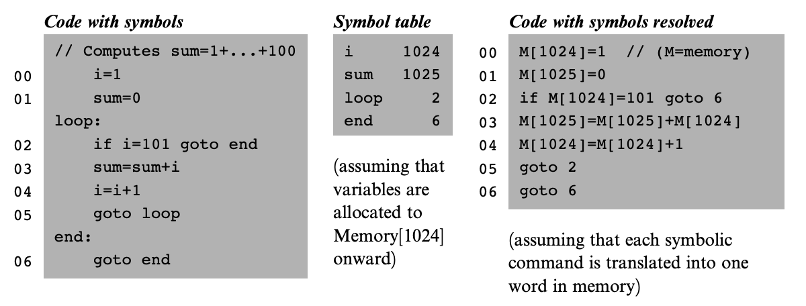
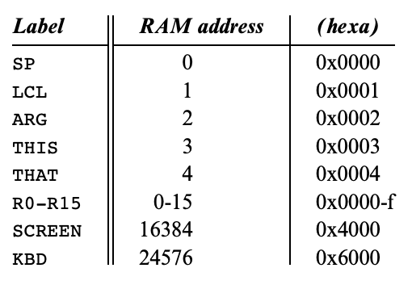
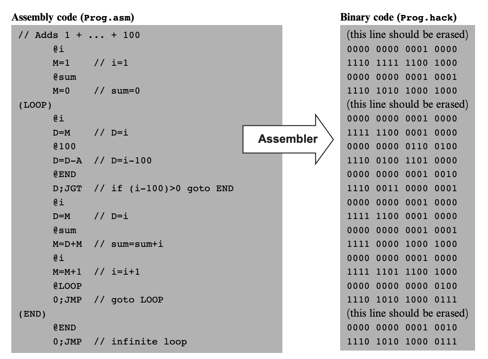

# 💻 The Elements of Computing System - 6

## 🤔 배경
- 기계어는 직관적이지 않음
- 다양한 연산 코드, 메모리 주소 지정 방식, 명령어 형식으로 인해서 2진 코드보다는 LOAD R3 7처럼 약속된 문법으로 표기하는 것이 더 직관적임
- 기호를 2진 코드로 옮기기는 쉽기 때문에 어셈블리 코드를 거쳐서 최종 실행 바이너리 코드로 빌드하는 것이 효율적임
- **기호**
  - 변수
    - 번역기가 기호로 표기된 변수명을 발견하면 자동적으로 그 기호를 주소에 할당함
  - 레이블
    - 프로그래머는 프로그램 내 다양한 위치를 기호로 표시해놓을 수 있음
    - 2진 명령어들은 실제 숫자를 이용해서 해당 변수의 메모리 주소를 표기하지만, 어셈블리는 그 대신 변수명을 직접 표기해서 사용할 수 있음
      - LOAD R3, 7 -> LOAD R3, weight

- **기호 변환**
  - 기호가 포함된 코드를 기호가 해석된 코드로 바꾸는 과정
    - 사용자 정의 변수 i와 sum은 차례대로 메모리 주소 1024와 1025를 할당받음
    - 레이블 loop와 end는 그 선언된 위치에 따라서 명령어 주소 2와 6을 각각 할당받음
    - 이에 대한 내용을 가운데의 기호 테이블에 표시하고, 기호 테이블을 토대로 최종 코드를 만들 수 있음

 

- **어셈블러**
  - 어셈블러는 기본적으로 번역 기능이 있는 텍스트 처리 프로그램이기 때문에 어셈블리 문법에 대한 전체 문서가 있어야 함
  - 기계어 명세라 불리는 규칙
    - 구문 분석을 통해 기호 명령 내 필드들 식별
    - 각 필드에 대응하는 기계어 비트 생성
    - 모든 기호 참조를 메모리 주소를 가리키는 숫자로 변환
    - 2진 코드들을 조립하여 완전한 기계 명령어로 변환

 

## 🤔 2진 번역 명세서 - 문법 관례와 파일 형식
- **파일명**
  - 관례적으로 어셈블리로 작성된 파일은 .asm, 2진 기계어 코드로 작성된 파일은 .hack 확장자를 가짐
- **2진 코드(.hack) 파일**
  - 16비트 기계어 명령어를 0과 1 형태의 ASCII 문자열로 작성되어 있음
  - 프로그램의 라인 번호와 명령어 메모리(ROM)의 주소는 둘 다 0에서 시작함
- **어셈블리어(.asm) 파일**
  - 명령어나 기호 선언이 어셈블리어로 작성되어 있음
    - 명령어 : A-명령어 or C-명령어
    - (Label) : 실제 기계어 코드로 번역되지 않지만, Symbol table에 (Label, Address)를 추가함
      - Address는 (Label) 다음에 쓰인 명령어의 주소임
- **상수와 기호**
  - 상수는 10진법으로 표기된 음수가 아닌 숫자
  - 기호는 문자, 숫자, 밑줄, 마침표, 달러 기호, 콜론들로 이루어진 문자열로 맨 앞 글자는 숫자가 아니어야 함
- **주석**
  - 두 개의 빗금에서 라인 끝까지의 텍스트는 주석으로 간주되어 무시됨
- **공백**
  - 공백 문자와 빈 라인은 무시됨
- **대소문자 규칙**
  - 어셈블리 연상기호는 전부 대문자로 써야 함
  - 사용자 정의 레이블과 변수명은 대소문자 구분을 함

 

## 🤔 2진 번역 명세서 - 기호
- 핵 어셈블리는 상수나 기호로 메모리 위치(주소)를 참조할 수 있는데, 다음은 어셈블리에서 기호를 쓰는 방법 세 가지임

- **선언 기호**
  - 핵 시스템이 기본적으로 제공하는 기호라고 생각

 

- **레이블 기호**
  - 실제 수행할 명령어가 아닌 의사 명령(Xxx)은 Xxx가 프로그램 다음 명령이 있는 명령어 메모리 주소를 참조하도록 정의함
- **변수 기호**
  - 프로그램 내에서 (Xxx)로 정의되지 않는 Xxx는 변수로 취급됨
  - 변수는 등장한 순서대로 RAM 주소 16부터 차례대로 매핑됨

 

## 🤔 2진 번역 명세서 - 구현

- 핵 어셈블러는 2진 코드를 생성하고 이 파일이 직접적으로 CPU에서 실행되지만, 일반적인 컴퓨터에서는 어셈블러가 16진수 object 파일을 만들고 만들어진 object 파일들을 linker가 조합하여 최종 실행 파일을 만듦
- 이를 Hex fiend로 열어보면 첫 부분에 라이브러리를 불러오는 헤더가 있고 중간 부분에 오브젝트 파일의 내용이 들어있는 것을 확인 가능함

